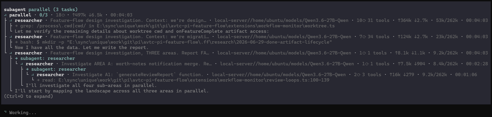

# avtc-pi-subagent

A subagent tool supporting context compaction and nested subagents — user-customizable models (with round-robin) and tool policies, extensible via hooks.



## Features

- **Isolated context** — each subagent runs in its own session with its own tools, system prompt, model, and skills.
- **Three dispatch modes** — single, parallel (concurrent), chain (sequential with `{previous}` hand-off).
- **Overridable `cwd`** — dispatch a subagent into a specific directory (e.g. a feature worktree) instead of the main repo.
- **Fork mode** — fork a subagent from the parent's session to reuse its prompt cache (see [Fork mode](#fork-mode)).
- **Model routing** — per-call override, per-agent config by name or glob with round-robin rotation, and pluggable resolvers (see [CONFIGURATION.md](docs/CONFIGURATION.md)).
- **Skills** — agents declare `skills:` in frontmatter; resolved and injected at dispatch; extra skill paths registerable.
- **Tool policy** — control which tools each subagent can use, per agent or by glob: add, block, or whitelist tools, with reusable named tool sets and `$all` (see [CONFIGURATION.md](docs/CONFIGURATION.md)).
- **Agent visibility** — hide agents from announcements or disable them entirely via config globs (`hidden-agents`, `disabled-agents`).
- **Concurrency & timeouts** — parallel limit, subagent timeout, inactivity timeout, and a nesting-depth cap to bound recursion.
- **Orphan-safe** — subagents self-terminate if the parent process dies.
- **Extensible** — other extensions integrate via the `pi-subagent:ready` event (model resolvers, prompt transformers, agent/skill paths).

## Defining agents

Agents are markdown files (YAML frontmatter + system prompt body) in `~/.pi/agent/agents/`. Frontmatter fields: `name`, `description`, `tools`, `model`, `skills`, `extensions`, `hide-from-agents-list`.

`hide-from-agents-list: true` omits the agent from the subagent tool's "Available agents" list. The agent stays fully usable when called by name (by a user, skill, or other agent).

## Fork mode

A `-fork` suffix marks a subagent as forked: it copies the parent's session system prompt and conversation history, so the prefill cache works. Set via the `PI_SUBAGENT_FORK_MODE` env var:

- `fork` — every subagent runs forked.
- `new+fork` — each subagent runs twice in parallel: a fresh copy and a forked copy.
- *(unset)* — every subagent runs as a fresh session (default).

## Spawn mode

Controls how subagent child processes run. Set via the `/subagent:settings` **Spawn mode** dropdown:

- **JSON** — each subagent runs as a single-shot process: it receives the task, runs to completion, and exits.
- **RPC** — each subagent runs as a long-lived process that the parent talks to over a request/response protocol. A long-running subagent that compacts its own context keeps going on its own (and the parent can recover it if compaction is cancelled), so long tasks run without stalling or aborting as the conversation grows. This is the default.


## Configuration

- **Operational settings** (timeout, concurrency, depth, spawn mode) — edit via `/subagent:settings`.
- **Model overrides** (which model each subagent uses) — see [CONFIGURATION.md](docs/CONFIGURATION.md).
- **Tool policy** (which tools each subagent can use: add / block / only, named sets, hide/disable agents) — see [CONFIGURATION.md](docs/CONFIGURATION.md).

## Extensibility

Building an extension that integrates with subagents (model resolvers, prompt transformers, agent/skill paths, env hooks)? See [EXTENSIBILITY.md](docs/EXTENSIBILITY.md).

## Tools

| Tool | Description |
|---|---|
| `subagent` | Delegate a task to a specialized agent (single / parallel / chain modes) |

## Commands

| Command | Description |
|---|---|
| `/subagent:settings` | Open the settings UI (concurrency, timeouts, max depth, spawn mode) |

## Installation

```bash
pi install npm:avtc-pi-subagent
```

## Full suite

Check out the full suite of related extensions, [avtc-pi](https://github.com/avtc/avtc-pi) — deterministic feature development, subagent delegation, working-memory, behavioral learning, parallel-work guardrails, durable decisions, notifications, and more.

Developed with [Z.ai](https://z.ai/subscribe?ic=N5IV4LLOOV) — get 10% off your subscription via this referral link.

## License

MIT
